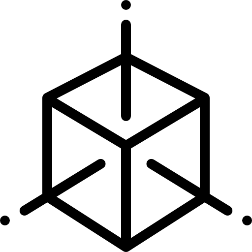
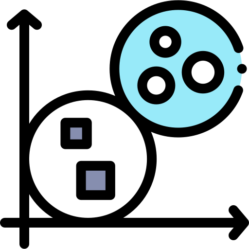

# Microstate Template Editor and Explorer

## Installation

1) Make sure you have installed Matlab 2022b or above.
2) Download the two files MSTemplateEditor.mlappinstall and MSTemplateExplorer.mlappinstall
3) In MATLAB, select the APPS tab, hit the Install App button, and select the two downloaded files
4) The Apps should now be available in the Apps toolbar of MATLAB
  
## Using the Microstate Template Editor

The Microstate Template Editor lets you import new sets of microstate template maps, check if the import completed correctly, and add findings associated with particular microstate class. It also collects data about the publication where these findings came out, and some extra-information like the number of subject and other parameters of the data and analysis. 

### Loading templates:
- If you have conducted the microstate analysis using our EEGLAB toolbox (available here: https://github.com/ThomasKoenigBern/microstates), you can directly import your grandmean(s) into the editor by using the 
 button. Note that you can only edit the template with a single number of classes. If your data contains more than one set, you will be asked to make a choice during the import.
- For data created in CarTool, you should be able to use the  button. Note that you also need the corresponding xyz file.
- For other data, you can read in the maps as map x electrode text file, and provide a list of electrode labels of the 10-20 system for the elecrode coordinates use the   button. 
- Other import options may be implemented upon reasonable request.

Once you have been able to import your templates, make sure they look as you expect it. 

### Editing templates
When editing your templates, you should do all of the following
1) Adjust, if necessary, the order of the templates to correspond to the order used in the publication,
2) Label the template maps according to the publication
3) Add, Edit, or Remove empirical findings. Please make sure you present them in a maximally concise and precise form.
4) Add all the information about the publication
5) Add the meta-information, such as number of subjects, filter-settings, software used, etc.

### Saving templates
Once our done editing, you can save the data using the Save  and SaveAs  buttons.

### Submitting your edited template to the database
Ideally, you send the resulting data to thomas.koenig(at)unibe.ch who will check it and add it to the database. Note, however, that we only accept template sets that have been accepted for publication. Please provide overall grandmean templates unless there is statistically supported evidence for topographic differences between relevant mean template sets.

## Using the Microstate Template Explorer
The Microstate Template Explorer only works with template data that has been processed using the Microstate Template Editor. A database of published templates is available for download from the GitHub repository.
Typically, you will want to go through the following steps. (For the rationales of these steps, see the the paper in the special issue of Brain Topography on microstates, as also found in this repository.) 

### Computation and visualization of the Similarity Matrix
- To compute the similarity matrix, all you need to do is to load all the templates that you want to include using the Template/Load Template Menu or the  button.
- Once the computation is finished, you will see the similarity matrix of all included maps. You can read out the similarities by hovering over the pixels of the matrix, and you can display the pair of maps that is associated with a given voxel by klicking on the voxel. 
- You can select subset of studies for display and futher analysis (see below) using the list-box in the lower right corner and the button below. 
- You can chanege the color scaling using the  and  buttons.
- You can filter the studies depending on the research domain using the  button, and remove the filter using the  button.

### Exporation of the Multidimensional Scaling (MDS)
Once the Similarity Matrix has been computed, you can switch to the MDS tab. Here, you can do the following: 
- You can identify and select particular maps of particular studies using the tree-control on the left, and you can visually explore the neighborhood of interesting maps using the mouse pointer. Double-clicking on a tree element or clicking on a point in the MDS display will select the associated map. This means that the map is shown on the right side of the display, and eventually associated findings are collected in the Findings Tab. You can select as many maps as you want. 
- You can use the Findings / Next best guess menu or the  button to display the next closest match to the first template map that you selected, and obtain its associated findings. This is particularly useful when the first template map you selected is from a new study, and you want to identify the relevant literature based on spatially similar maps (added 30.6.2023).
- You can switch between a 2D and a 3D visualization using the View menu or using the  button.
- You can clear all selected maps and findings using the  button or using the Findings/Clear menu.
- If you have computed Meta-Microstate maps (see below), they will also appear in the tree-control. You can show the assigment to these metamaps by selecting the corresponding tree-control element.

### Exploration of selected findings
Once you have selected a set of maps or meta-maps, the associated findings, and the corresponding publications appear in the Findings tab. You have the option to export this data to an Excel spreadsheet from the Findings menu, and you can have a look at the details of the study by clicking on the study ID or the title of the study (opens the study in the template editor) or by clicking on the DOI (opens the corresponding paper).

### Computation of Meta-Microstate Maps
- The MSTemplateExplorer allows you to compute a k-means clustering across all included template maps using the Meta-Maps/Compute Meta-Maps menu item or using the  button. You will be asked for a file with the electrode positions to be used to compute these metamaps. The format of this file is given below. Once the computation is complete, the maps will be displayed.
- You can reorder and polarity-flip the obtained meta-microstate maps using the  button or the Reorder Meta-Maps/Meta-Maps menu item. You then need to give the new order of maps for each solution. For polarity reversals, add a minus to the position.
- You can export the obtained Meta-Maps to be directly used in our EEGLAB microstate toolbox. 
### Saving the configuration
Once you're done, you can save the entire data structure using the File/Save Configuration Menu or the  button. To load a previously saved data structure, use the File/Load Configuration Menu or the  button. The resulting files are MATLAB readable, but yet to be documented.

## Supplementary information
### Structure of the electrode coordinate file
(First line gives the number of channels, remaining lines are xyz coordinates and labels)

71  
0.9230 0.0000 -0.3824 Nz  
-0.9230 0.0000 -0.3823 Iz   
0.0001 0.7066 0.7066 C3   
....

## History & Changelog
- 1.6.2023: Initial commit
- 30.6.2023. Added the possibility to search for the next best guesses based on spatial similarity.
- 25.4.2024 Possibility to filter the studies and work only on subsets of the entire database.
